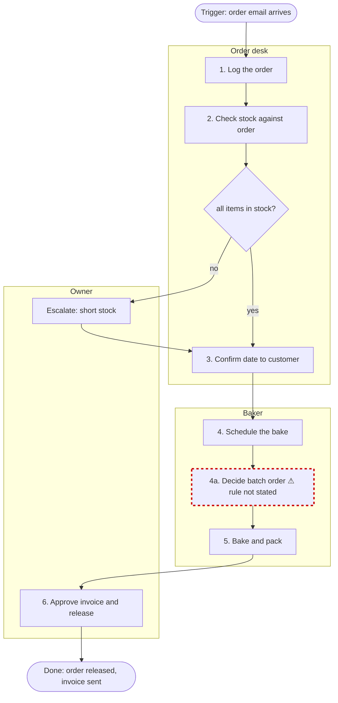

# Mermaid conventions

The diagram is the decision inventory drawn. process.mmd is the deliverable. A rendered picture is a convenience.

## Rules

1. `flowchart TD`. Top to bottom, so a seven-step process fits on a page.
2. One `subgraph` per actor from D-a, titled with the role. Every step node sits inside its actor's subgraph. If two actors share a step, it goes in the subgraph of the one who decides.
3. Step nodes are rectangles: `S1["1. Pull the week's notes"]`. Number them in Q3 order.
4. A step with a stated rule (D-a gave "if X then Y") gets a diamond after it: `D1{"if X?"}` with labeled edges `-->|yes|` and `-->|no|`. The diamond carries the rule text, shortened to fit.
5. A step where a decision exists but the rule could not be stated gets a marked node: `U3["3. Decide what needs a note ⚠ rule not stated"]` with `style U3 stroke:#c00,stroke-width:3px,stroke-dasharray:5`. No diamond, because there is no rule to draw. This node is the reason the diagram exists.
6. Exceptions from D-b that route somewhere (escalate, ask, stop) are edges to a node in the owner's subgraph: `E1["Escalate: missing minutes"]`. Exceptions that are handled in-step are not drawn; they are in the inventory table.
7. Start and end are stadium nodes outside every subgraph: `START(["Trigger: Q1"])` and `END_(["Done: Q2"])`. Use `END_` because `end` is a reserved word.
8. No colors beyond the marked-node style. No icons. No links.
9. Keep labels under 40 characters. Put the full text in decision-inventory.md.

## Worked example

Fictional process: a small bakery filling a wholesale order. Three actors.

## Rendering

After writing process.mmd:

- If the session can run shell commands and `mmdc` (mermaid-cli) is on the path, run `mmdc -i process.mmd -o process.png` and save the PNG beside it. Say so in run-log.md.
- If `mmdc` is not on the path, do not install it. Say in one line: "process.png not rendered; mermaid-cli is not installed here. Paste process.mmd into mermaid.live to see it." Record that line in run-log.md.
- If `mmdc` is on the path and fails (it needs a browser engine that sandboxes often lack), do not install or configure anything. Say the PNG was not rendered, quote the first line of the error, and point to mermaid.live. Record it in run-log.md.
- process.mmd carries the packet header as `%%` comment lines at the top, because YAML front matter is not valid Mermaid.
- If the session can publish an artifact, show the diagram as an artifact so the SME can check it at gate 3. That is a preview, not a packet file.
- If the session has Lucid tools (a connector whose tools create a diagram from Mermaid or a specification), offer once at gate 3: "I can also create this in Lucid as a share-ready diagram. Want that?" On yes, create it from process.mmd and put the link in run-log.md. On no, or if the tools are absent, say nothing more about Lucid. The Mermaid file is the deliverable either way; never make the packet depend on Lucid.
